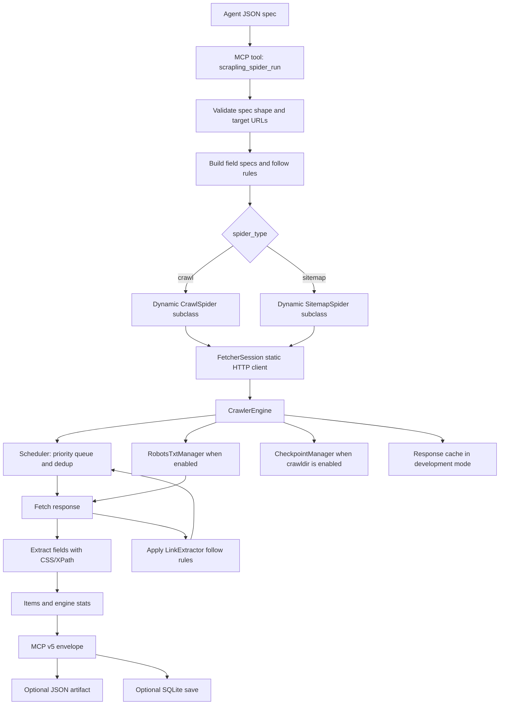

# Scrapling Spider Runner Logic

`scrapling_spider_run` turns an Agent-readable JSON spec into a temporary in-memory
Scrapling spider. It is designed for crawl strategy validation: prove the queue,
rules, sitemap, robots, checkpoint, and extraction shape before a production crawler
is written.

## Spec Inputs

- `spider_type`: `crawl` or `sitemap`
- `start_urls` or `sitemap_urls`
- `allowed_domains`: optional; seed domains are added automatically, including `host:port`
- `item_selector`: optional repeated item scope
- `item_fields`: CSS/XPath field map
- `follow_rules`: optional link extraction rules with `allow`, `deny`, `restrict_css`, `restrict_xpath`, `callback`, and `priority`
- `max_depth`, `max_items`, `concurrent_requests`, `download_delay`
- `robots_txt_obey`, `use_checkpoint`, `crawldir`, `development_mode`

## Output Contract

- `items`: extracted records with `_source_url`
- `stats`: Scrapling engine stats, including requests, offsite filters, robots blocks, cache hits/misses, status counts, and bytes
- `spec_summary`: normalized sources, domains, fields, rules, depth, and checkpoint settings
- `artifact_path`: optional JSON output path
- `db_result`: optional SQLite save result

## Boundaries

- No CAPTCHA solving.
- No login-wall bypass.
- Private/local targets are blocked unless the caller explicitly enables trusted `allow_private`.
- Stealth browser dependencies may exist in the vendored source, but this runner defaults to static `FetcherSession`.
